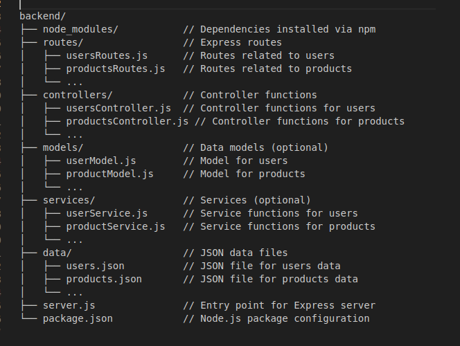

# Objectives

creating the backend for a MERN full stack app

To Do:

- [x] create the backend with express by creating the routes in the app.js
- [x] separate the route handler from the routes and modify the app.js file to import the routs and use the express router.
- [ ] modify th backend to use mongoose and the (models folder, config and middelware)

# File Structure

backend/
├── node_modules/           // Dependencies installed via npm
├── routes/                 // Express routes
│   ├── usersRoutes.js      // Routes related to users
│   ├── productsRoutes.js   // Routes related to products
│   └── ...
├── controllers/            // Controller functions
│   ├── usersController.js  // Controller functions for users
│   ├── productsController.js // Controller functions for products
│   └── ...
├── models/                 // Data models (optional)
│   ├── userModel.js        // Model for users
│   ├── productModel.js     // Model for products
│   └── ...
├── services/               // Services (optional)
│   ├── userService.js      // Service functions for users
│   ├── productService.js   // Service functions for products
│   └── ...
├── data/                   // JSON data files
│   ├── users.json          // JSON file for users data
│   ├── products.json       // JSON file for products data
│   └── ...
├── server.js               // Entry point for Express server
└── package.json            // Node.js package configuration
