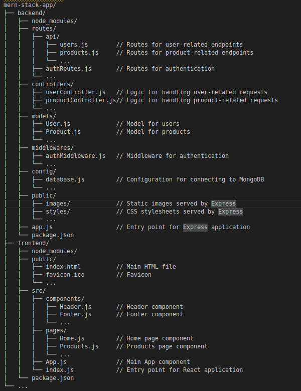

# Objectives

creating the backend for a MERN full stack app

To Do:

- [X] create the file structur of the MERN stack.
- [ ] create the backend of the project that maps the data which have been used for the react frontend (using json files for the data from the frontend and using fs module)
- [ ] modify the frontend to retrieve the data from the backend(api)
- [ ] modify th backend to use mongoose and the (models folder, config and middelware)

# Project planing with chatgpt

[https://chat.openai.com/share/81cf2bcd-39d5-4721-b17c-650c426e9bf5]()

# File structure

mern-stack-app/
├── backend/
│   ├── node_modules/
│   ├── routes/
│   │   ├── api/
│   │   │   ├── users.js        // Routes for user-related endpoints
│   │   │   ├── products.js     // Routes for product-related endpoints
│   │   │   └── ...
│   │   ├── authRoutes.js       // Routes for authentication
│   │   └── ...
│   ├── controllers/
│   │   ├── userController.js   // Logic for handling user-related requests
│   │   ├── productController.js// Logic for handling product-related requests
│   │   └── ...
│   ├── models/
│   │   ├── User.js             // Model for users
│   │   ├── Product.js          // Model for products
│   │   └── ...
│   ├── middlewares/
│   │   ├── authMiddleware.js   // Middleware for authentication
│   │   └── ...
│   ├── config/
│   │   ├── database.js         // Configuration for connecting to MongoDB
│   │   └── ...
│   ├── public/
│   │   ├── images/             // Static images served by Express
│   │   ├── styles/             // CSS stylesheets served by Express
│   │   └── ...
│   ├── app.js                  // Entry point for Express application
│   └── package.json
├── frontend/
│   ├── node_modules/
│   ├── public/
│   │   ├── index.html          // Main HTML file
│   │   ├── favicon.ico         // Favicon
│   │   └── ...
│   ├── src/
│   │   ├── components/
│   │   │   ├── Header.js       // Header component
│   │   │   ├── Footer.js       // Footer component
│   │   │   └── ...
│   │   ├── pages/
│   │   │   ├── Home.js         // Home page component
│   │   │   ├── Products.js     // Products page component
│   │   │   └── ...
│   │   ├── App.js              // Main App component
│   │   └── index.js            // Entry point for React application
│   └── package.json
└── ...

backend/
├── node_modules/           // Dependencies installed via npm
├── routes/                 // Express routes
│   ├── usersRoutes.js      // Routes related to users
│   ├── productsRoutes.js   // Routes related to products
│   └── ...
├── controllers/            // Controller functions
│   ├── usersController.js  // Controller functions for users
│   ├── productsController.js // Controller functions for products
│   └── ...
├── models/                 // Data models (optional)
│   ├── userModel.js        // Model for users
│   ├── productModel.js     // Model for products
│   └── ...
├── services/               // Services (optional)
│   ├── userService.js      // Service functions for users
│   ├── productService.js   // Service functions for products
│   └── ...
├── data/                   // JSON data files
│   ├── users.json          // JSON file for users data
│   ├── products.json       // JSON file for products data
│   └── ...
├── server.js               // Entry point for Express server
└── package.json            // Node.js package configuration
